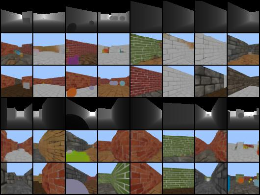

# Vector-Quantize-Generative-Models
Implementation of vector quantize-based generative models with good readability and minimal dependencies, including vector quantize model, transformer generator (VQGAN) and diffusion model (LDM). All models are tested under the pc with RTX 2070 GPU.

## Dependancy
Dpendencies of the models:
- pytorch = 2.0.1
- torchvision = 0.15.2

The training data is based on Maze3D environments, with the following dependancies:
- pyglm = 2.7.0
- pyrender = 0.1.39
- pyopengl = 3.1.0

## Models
### Vector Quantize Model


```
python train_vqvae.py

# Optional, used for conditional transformer
python train_vqvae_depth.py 
```

Image Reconstruction Results of VQVAE


Depth Reconstruction Results of VQVAE


### Latent Diffusion Model 


```
python train_ldm.py

# Depth conditional generation (cross-attention)
python train_ldm_condition.py

# Depth conditional generation (concatenation)
python train_ldm_condition_cat.py
```

Random Generation Results of LDM


Conditional Generation Results of LDM (Cross-Attention)


Conditional Generation Results of LDM (Concatenation)


### Transformer Generation Model


```
python train_transformer.py

# Depth conditional generation (decoder-only)
python train_transformer_condition.py

# Depth conditional generation (encoder-decoder)
python train_transformer_condition_encdec.py
```

Random Generation Results of Transformer


Conditional Generation Results of Transformer (Decoder-Only)


Conditional Generation Results of Transformer (Encoder-Decoder)



### Latent DRAW Model (Experimental)
```
python train_draw.py

# Depth conditional generation
python train_draw_condition.py
```

Random Generation Results of DRAW


Conditional Generation Results of DRAW


## References
- Van Den Oord, Aaron, and Oriol Vinyals. "Neural discrete representation learning." Advances in neural information processing systems 30 (2017).
- Esser, Patrick, Robin Rombach, and Bjorn Ommer. "Taming transformers for high-resolution image synthesis." Proceedings of the IEEE/CVF conference on computer vision and pattern recognition. 2021.
- Rombach, Robin, et al. "High-resolution image synthesis with latent diffusion models." Proceedings of the IEEE/CVF conference on computer vision and pattern recognition. 2022.
- Vaswani, Ashish, et al. "Attention is all you need." Advances in neural information processing systems 30 (2017).
- https://github.com/karpathy/nanoGPT
- https://github.com/dome272/VQGAN-pytorch
- https://github.com/Alokia/diffusion-DDIM-pytorch